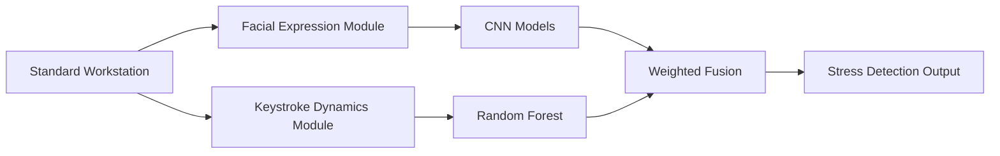

# 🧠 Stress-Scape: Multimodal AI Framework for Non-Invasive Stress Detection

<div align="center">

[](https://www.python.org/)
[](https://www.tensorflow.org/)
[](https://keras.io/)
[](https://opencv.org/)
[](https://scikit-learn.org/)

[](https://github.com/Sahilsonii/Stress-Scape-Multimodal-AI-Framework-for-Non-Invasive-Stress-Detection/stargazers)
[](https://github.com/Sahilsonii/Stress-Scape-Multimodal-AI-Framework-for-Non-Invasive-Stress-Detection/network)
[](https://github.com/Sahilsonii/Stress-Scape-Multimodal-AI-Framework-for-Non-Invasive-Stress-Detection/issues)

**A privacy-preserving, software-only system for real-time workplace stress detection using facial expressions and keystroke dynamics.**

</div>

---

## 🌟 Overview

**Stress-Scape** is a multimodal AI framework for **non-invasive, real-time stress detection** using only software-based indicators from standard workstations — no wearable sensors required.

- 🚫 **No Wearable Sensors** — facial webcam + keyboard input only
- 🔒 **Privacy-Preserving** — all processing happens locally
- ⚡ **Real-Time** — 25–30 FPS on CPU for the facial modality
- 💰 **Cost-Effective** — no hardware beyond a standard workstation + webcam

---

## 🏗️ System Architecture



### 🎭 Facial Expression Modality

- **Models:** MobileNetV2, EfficientNetB0, ResNet50V2 (transfer learning, ImageNet-pretrained)
- **Dataset:** 53,571 augmented images — FER2013 public benchmark + 1,400 author-consented custom images
- **Emotions → Binary mapping:** Stressed = {angry, disgust, fear, sad, neutral}, Not Stressed = {happy, surprise}
- **Training:** Two-phase transfer learning (30 epochs frozen-base + 10 epochs fine-tune)

### ⌨️ Keystroke Dynamics Modality

- **Algorithm:** Random Forest classifier (100 trees), Decision Tree baseline for comparison
- **Dataset:** [CMU Keystroke Dynamics Benchmark](https://www.cs.cmu.edu/~keystroke/) (Killourhy & Maxion, 2009) — 51 subjects × 400 repetitions of a fixed password, real per-keystroke hold/flight timing data
- **Features:** `hold_mean`, `hold_std`, `flight_mean`, `flight_std`, `total_duration` (5 timing-derived features — see note below)
- **Labels:** within-subject relative typing-irregularity proxy (deviation from each participant's own baseline; the public dataset carries no stress ground truth)
- **Validation:** group-aware split by subject (no participant appears in more than one split) + 5-fold group-aware cross-validation

> **Note on the keystroke feature set:** the public CMU dataset is fixed-password
> hold-time/flight-time data — it does not contain backspace counts, word
> counts, or error rates. If you've seen an earlier version of this README
> describing those features, that described a feature set the underlying
> public dataset can't actually produce; this version reflects what the
> `train_keystroke_rf.py` pipeline in this repo actually computes and trains
> on.

---

## 📊 Performance Results

*(all numbers below are read directly from `StressScape/Facial-stress-prediction/results/*/metrics.json` and `classification_report.txt` — regenerate them yourself with `regenerate_reports_only.py` / `train_keystroke_rf.py` to verify)*

### 🏆 Facial Expression Models

| Model | Accuracy | Precision | Recall | F1-Score | AUC |
|-------|----------|-----------|--------|----------|-----|
| **ResNet50V2** ⭐ | **0.886** | **0.948** | **0.889** | **0.918** | 0.826 |
| MobileNetV2 | 0.848 | 0.945 | 0.836 | 0.887 | **0.936** |
| EfficientNetB0 | 0.805 | 0.939 | 0.778 | 0.851 | 0.750 |

ResNet50V2 has the best overall accuracy/precision/recall/F1; MobileNetV2 has the highest AUC and is the most computationally efficient (~14MB, fastest inference).

### ⌨️ Keystroke Dynamics: Random Forest vs. Decision Tree

| Model | Test Accuracy (θ=0.5) | Precision | Recall | F1-Score |
|-------|------------------------|-----------|--------|----------|
| **Random Forest** ⭐ | **73.65%** | 0.560 | 0.637 | 0.596 |
| Decision Tree (baseline) | 72.00% | 0.536 | 0.611 | 0.571 |

- **5-fold group-aware cross-validation (RF):** 78.78% ± 2.52% accuracy
- **RF vs. Decision Tree:** +1.65 percentage points
- **Top predictive feature:** flight-time variability (`flight_std`, 49.8% of feature importance) — consistency of the pause between key transitions is the strongest signal, followed by total typing duration (15.1%), flight-time mean (13.5%), hold-time variability (13.0%), and hold-time mean (8.6%)
- **Threshold-tuned variant (θ=0.35, selected on validation, F1-maximizing):** test precision 0.472, recall 0.753 — trades precision for recall relative to the default threshold

---

## 📦 Dataset Information

### 🎭 Facial Expression Dataset

- **Total:** 53,571 images (40,096 train / 13,475 validation)
- **Sources:** FER2013 public benchmark (Kaggle) + 1,400 custom images (2 consenting authors, 700 images each across 7 emotions, ASUS TUF F15 webcam)
- **Augmentation:** rotation (±20°), width/height shift (±20%), shear (15° max), zoom (±15%), horizontal flip (50%), brightness (±20%)

### ⌨️ Keystroke Dataset

- **Source:** [CMU Keystroke Dynamics Benchmark](https://www.cs.cmu.edu/~keystroke/) — download `DSL-StrongPasswordData.csv` and place it at `StressScape/Facial-stress-prediction/data/DSL-StrongPasswordData.csv`
- **51 subjects × 400 repetitions** of the fixed password `.tie5Roanl` = 20,400 total repetitions
- **Split:** group-aware by subject — 31 subjects/12,400 samples train (60.8%), 10 subjects/4,000 samples validation (19.6%), 10 subjects/4,000 samples test (19.6%)

---

## 🚀 Quick Start

### 📋 Prerequisites

- Python 3.8+ (a `.venv` per-component is recommended — see below)
- Webcam (for facial capture/inference)
- NVIDIA GPU optional, for faster CNN training

### 🔧 Installation

```bash
git clone https://github.com/Sahilsonii/Stress-Scape-Multimodal-AI-Framework-for-Non-Invasive-Stress-Detection.git
cd Stress-Scape-Multimodal-AI-Framework-for-Non-Invasive-Stress-Detection/StressScape/Facial-stress-prediction

python -m venv venv
source venv/bin/activate  # Windows: venv\Scripts\activate
pip install -r requirements.txt
```

Requirements include TensorFlow/Keras, OpenCV, scikit-learn, matplotlib/seaborn, reportlab, and — for the keystroke/live-fusion side — `joblib` and `pynput`.

---

## 💻 Usage

### 🎭 Train a facial expression model

```bash
python train_mobilenet.py      # or train_efficientnet.py / train_resnet.py
```
Each script does its own two-phase transfer learning, checkpointing every epoch, and writes `results/{Model}/metrics.json` + `classification_report.txt` when done.

### ⌨️ Train the keystroke Random Forest

```bash
# 1. Download the real CMU dataset once:
curl -o data/DSL-StrongPasswordData.csv https://www.cs.cmu.edu/~keystroke/DSL-StrongPasswordData.csv

# 2. Train:
python train_keystroke_rf.py
```
Writes `results/Keystroke/metrics.json`, `classification_report.txt`, confusion matrix, feature-importance chart, threshold-optimization curve, and the trained `random_forest_model.pkl`.

### 📊 Regenerate comparison reports (no retraining)

```bash
python regenerate_reports_only.py
```

### 🎥 Live facial-only stress detection

```bash
python webcam_stress_detector.py
```

### 🔗 Live multimodal (facial + keystroke) fusion demo

```bash
python combined_stress_monitor.py   # Tkinter UI, in-app typing capture
# or
python modern_stress_monitor.py     # Tkinter UI, global keyboard capture (pynput)
```
Both apps load the trained facial model (`results/ResNet50V2/saved_model`) and the trained keystroke model (`results/Keystroke/random_forest_model.pkl`), extract the same 5-feature timing vector `train_keystroke_rf.py` was trained on (via `keystroke_features.py`), and combine the two modality probabilities with a weighted fusion (`DEFAULT_ALPHA = 0.6` favoring the facial signal). If the keystroke model hasn't been trained yet, they degrade gracefully to facial-only instead of crashing.

### ⌨️ Standalone keystroke session capture

```bash
python keystroke_timing_logger.py --name yourname
```
Captures a real short typing session and logs the keystroke model's prediction to `results/Keystroke/fusion_sessions.csv` — used for pairing with a facial-model prediction to evaluate the fusion pipeline on real (not simulated) data.

---

## 📁 Project Structure

```
StressScape/Facial-stress-prediction/
├── data/                                  # CMU keystroke dataset (gitignored, download separately)
├── original dataset/, balanced_train/, balanced_validation/   # Facial datasets (gitignored)
├── results/
│   ├── MobileNetV2/ | EfficientNetB0/ | ResNet50V2/            # metrics.json, classification_report.txt,
│   │                                                            # confusion matrix + training-history figures
│   ├── Keystroke/                          # Real RF results: metrics, confusion matrix, feature
│   │                                        # importance, threshold sweep, split summary
│   ├── comparison/                         # Cross-model comparison figures
│   └── FINAL_MODEL_COMPARISON_REPORT.pdf
├── capture_dataset.py                      # Facial dataset capture via webcam
├── data_augmentation_balancer.py           # Facial class-balancing augmentation
├── train_mobilenet.py / train_efficientnet.py / train_resnet.py
├── train_keystroke_rf.py                   # Real keystroke Random Forest, trained on CMU data
├── keystroke_features.py                   # Shared live hold/flight/duration feature extraction
├── keystroke_timing_logger.py              # Standalone real typing-session capture tool
├── generate_comparison_report.py / regenerate_reports_only.py
├── webcam_stress_detector.py               # Facial-only live detector
├── combined_stress_monitor.py / modern_stress_monitor.py   # Live multimodal fusion UIs
├── system_logger.py                        # Shared structured logging utility
└── requirements.txt
```

---

## 🎯 Research Contributions

1. Software-based, privacy-preserving stress detection deployable on standard workstations
2. Rigorous comparison of three transfer-learning CNN architectures for facial stress classification
3. A real, reproducible keystroke-dynamics Random Forest trained on the public CMU benchmark, with a documented within-subject proxy-labeling methodology and leakage-aware feature/label separation
4. Deployment-ready real-time multimodal architecture with local inference and temporal smoothing

---

## ⚖️ Ethical Framework

- **Informed Consent** — participants informed before monitoring; opt-out without penalty
- **Purpose Limitation** — wellness only, never performance review or hiring
- **Local Storage & Minimization** — all processing local, no cloud transmission
- **Pseudonymization** — stress logs avoid PII where possible
- **Human Supervision** — predictions are informational, not a replacement for human judgment

---

## ⚠️ Known Limitations

| Limitation | Notes |
|---|---|
| **Proxy label validity** | Both modalities use proxy labels (FER2013 emotion mapping; keystroke within-subject timing deviation) — neither is validated against physiological or self-reported stress ground truth |
| **Dataset bias** | Facial dataset skews toward the two author-contributors for the custom portion; broader demographic validation is future work |
| **Small keystroke participant pool** | 51 subjects is enough for a real, evaluated model but the 78.78% ± 2.52% CV spread reflects real between-subject variance at this scale |
| **Domain shift** | Models trained on FER2013/CMU may not transfer perfectly to naturalistic workplace settings without further validation |
| **Fusion evaluation** | The weighted fusion pipeline is implemented and runs live; a systematic paired multi-participant benchmark is in progress |

---

## 🤝 Contributing

- Systematic paired facial+keystroke fusion benchmarking
- Temporal modeling (LSTM/GRU) for stress evolution over time
- Domain adaptation for naturalistic workplace deployment
- Fairness-aware training across demographics
- Additional behavioural modalities

## 🙏 Acknowledgments

- **FER2013 Dataset** — Kaggle community
- **CMU Keystroke Dynamics Benchmark** — Killourhy & Maxion, Carnegie Mellon University
- **Transfer Learning Models** — TensorFlow/Keras pre-trained ImageNet weights

## 📄 License

This project is for educational and research purposes.
